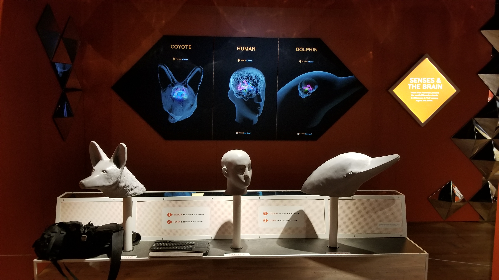
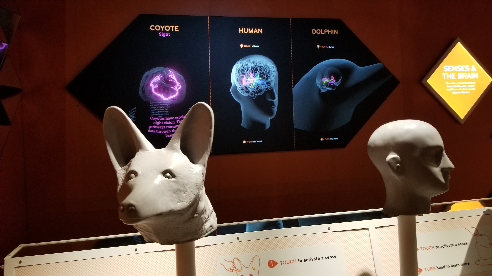
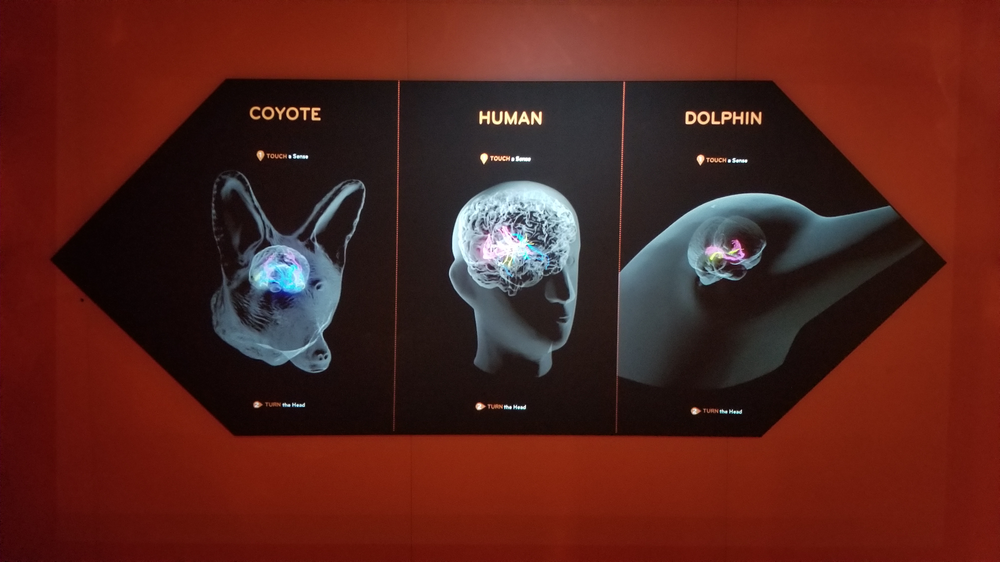
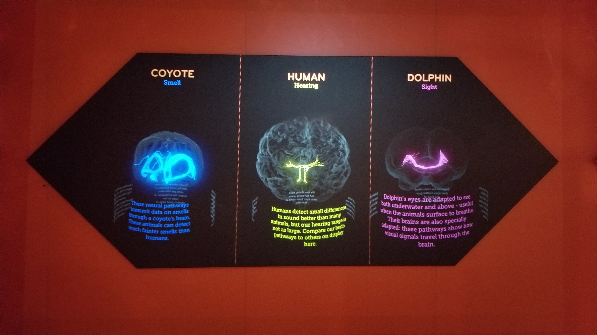

# NeuralPathways
- An educational 3D interactive exhibit piece about the neural pathways of the visual, auditory, and olfactory senses for coyotes, humans, and dolphins for the special exhibit “Our Senses: An Immersive Experience,” currently open at the American Museum of Natural History.
- Visitors touch sensors on the head models of the three animals and rotate the heads to read about the specific sense they have chosen (check video in repo for reference).

